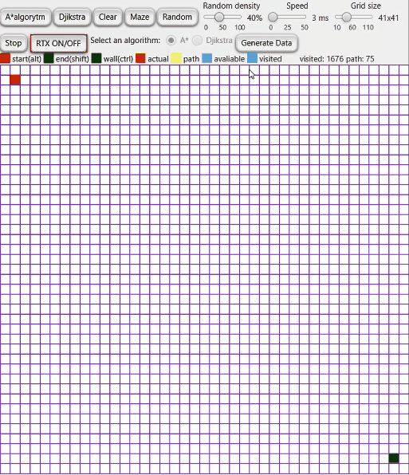

# PathfindingVisualizer

This project uses Java and JavaFX to visualize two pathfinding algorithms: A* and Dijkstra.

## Comparision on empty grid

| A* algorithm | Dijkstra algorithm |
| :---:      | :---:       |
|      |  |

## Maze creation(Kruskal's method and random)

| Kruskal's method | Random low/high density |
| :---: | :---: |
|  | |

## RTX ON/OFF - Real Time Experience :) - pick algorithm
You can move start and end and in the meantime it will calculate path, it may lag on bigger grids. Turn on and pick algorithm with radio button.

| A* algorithm | Dijkstra algorithm |
| :---:      | :---:       |
|      |  |

## Draw your own mazes
Just hold ctrl and draw walls, alt and shift to change location of start and end.

## Visited and path count
Counts how many squares were visited and path length.

## Clear
Just clear grid.

## Change options
You can change few options: random density, speed, grid size( bigger = slower :) ).

## Generate Data
Logs map(x, y, isWall, isStart, isEnd, Colour) to file.

